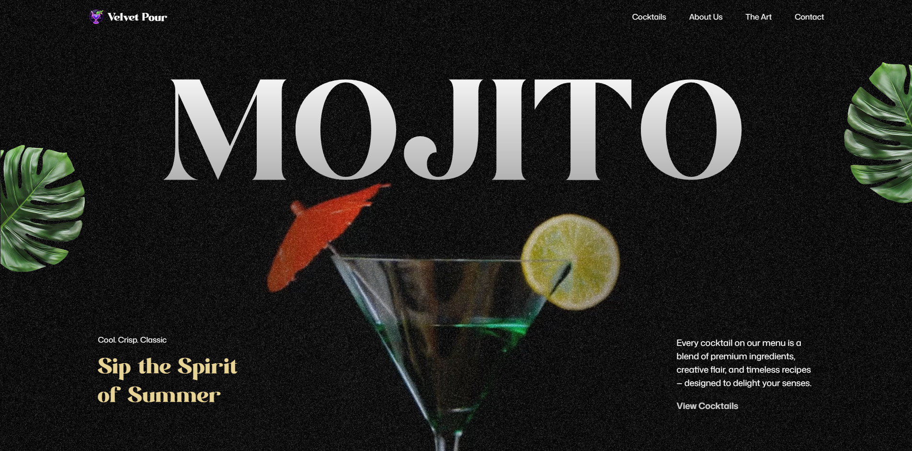

# GSAP Cocktails

<p align="center">
  <a href="https://alifnrhman-gsap-cocktails.vercel.app">
    
  </a>
  
  
  
  
</p>

<h4 align="center">An animated cocktail showcase website built with Vite, Tailwind CSS, and GSAP</h4>
<p align="center"><i>Note: This is a static frontend project with hardcoded data (no external APIs).</i></p>

<p align="center">
  <a href="#key-features">Key Features</a> •
  <a href="#how-to-use">How To Use</a> •
  <a href="#live-demo">Live Demo</a> •
  <a href="#screenshots">Screenshots</a> •
  <a href="#credits">Credits</a> •
  <a href="#developers">Developers</a> •
  <a href="#license">License</a>
</p>


## Key Features

* Animated hero section using **GSAP**
* Static showcase of various **cocktails** (data stored in constants)
* **About section** describing the concept or background
* Custom **art section** for branding or thematic visuals
* **Contact section** with address, phone number, email, and business hours
* Responsive layout powered by **Tailwind CSS** and **react-responsive**
* Built with **Vite** for fast development and optimized build


## How To Use

### Requirements:
- Node.js (v14 or newer)
- npm or yarn

### Steps:

1. Clone the repository:
```bash
git clone https://github.com/alifnrhman/gsap-cocktails.git
```

2. Navigate into the project folder:
```bash
cd gsap-cocktails
```

3. Install dependencies:
```bash
npm install
```

4. Start the development server:
```bash
npm run dev
```

5. Open your browser and go to `http://localhost:5173`


## Live Demo

🌐 [Visit the live site](https://alifnrhman-gsap-cocktails.vercel.app/)


## Screenshots

### 🖼️ Hero Section




## Credits

This project uses:

* [GSAP](https://greensock.com/gsap/) — for animations
* [Tailwind CSS](https://tailwindcss.com/) — utility-first CSS framework
* [Vite](https://vitejs.dev/) — next-generation frontend tooling
* [react-responsive](https://github.com/yocontra/react-responsive) — for responsive rendering based on screen size

> 🧠 This project was built entirely by following the tutorial by [JavaScript Mastery](https://www.youtube.com/c/javascriptmastery). All structure, animations, and layout are based on their original guide.


## Developers

- **Alif Nurahman** — [@alifnrhman](https://github.com/alifnrhman)


## License

MIT License
